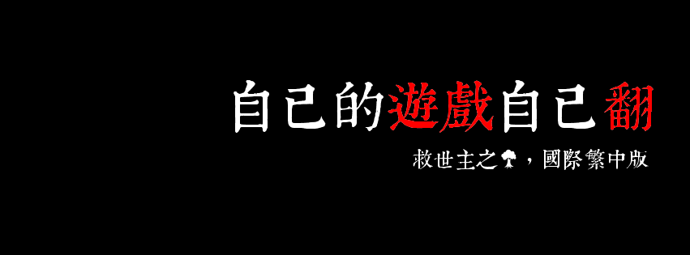
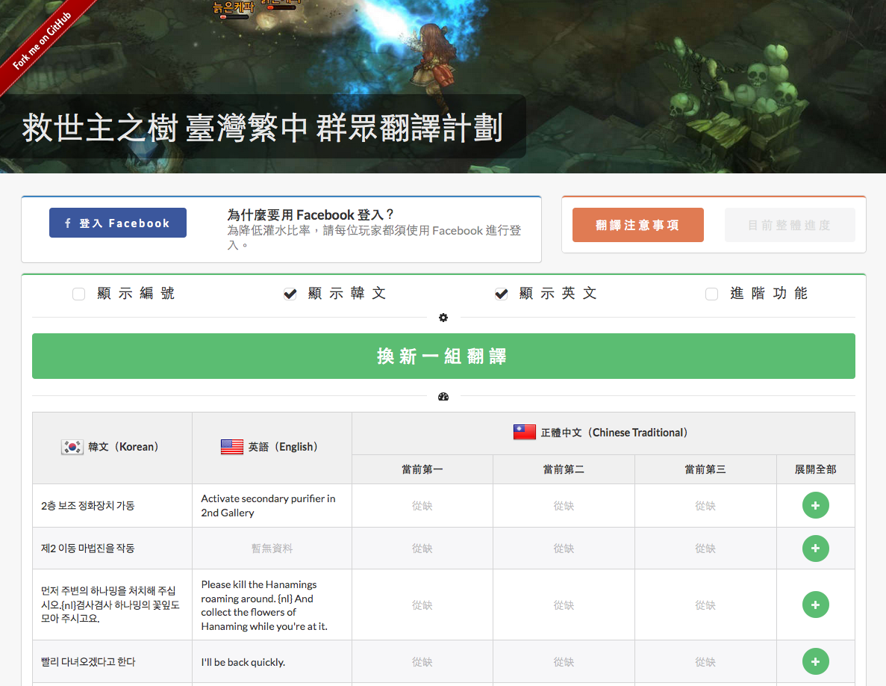
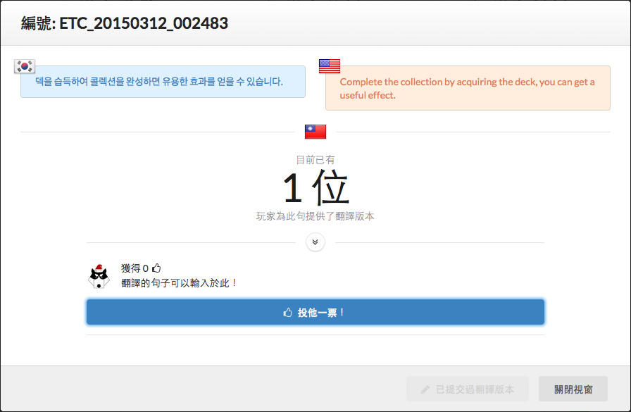
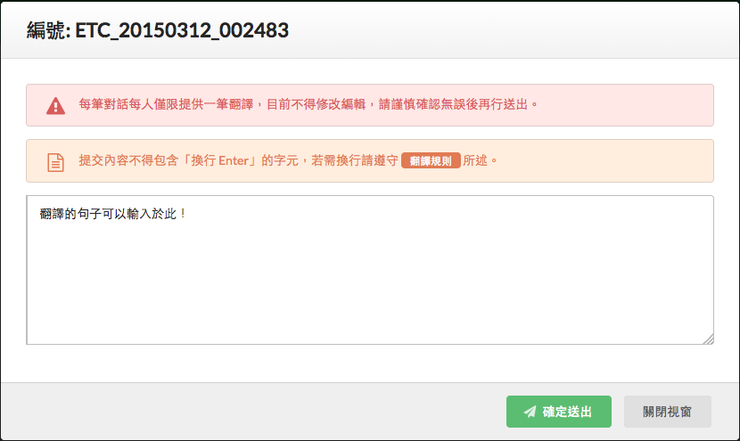
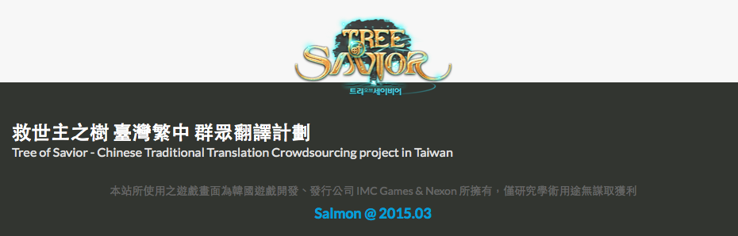

## 救世主之樹 國際繁中版群眾翻譯系統

### Tree of Savior - Crowdsourcing Translation

---

### 程式流程 Workflow

1. #### 原文資料抓取（Base data parsing）

    *zh*: 系統自動至官方 GitHub 下載當前的最新語言文件包。

    *en*:
2. #### 多語言合併（Merging multi-languages）

    *zh*: 將相同檔名的韓文、英文做合併處理、資料建檔。

    *en*:
3. #### 群眾資料初始化（Initail crowdsourcing data）

    *zh*: 依照不同語言文件編號，產生相對應的群眾資料集。

    *en*:
4. #### 玩家群眾翻譯（Crowdsourced translation）

    *zh*: 玩家登入 Facebook 後在首頁隨機取出幾筆，進而提交翻譯版本。

    *en*: 
5. #### 翻譯版本排行（Traslations ranking）
    *zh*: 玩家可以針對不同對話內容的各個翻譯版本中挑選幾筆給予贊同，然後依照贊同數量決定該版本的排行順序。

    *en*:

---

### 執行環境 Environment

* Node.js

* 不使用資料庫（Not using database）

---

### 執行方式 Processing

1. 

---

### 畫面截圖 Screenshots

---

### 授權 License

The MIT License for code of this project.

About Game screenshot images all rights reserved by IMC Games & Nexon.

